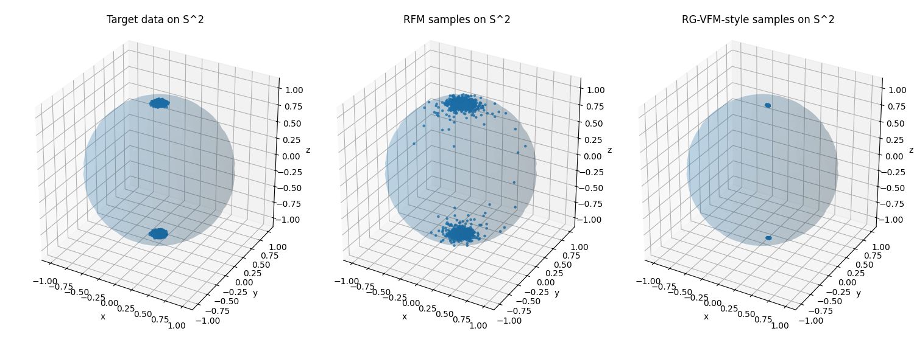

# Riemannian Variational Flow Matching — notes on toy examples (stub)

**Status.** This repository is a small stub, not a full reproduction of the paper. It contains simple Euclidean and spherical toy examples implementing variants of Flow Matching, Riemannian Flow Matching (RFM), and an RG-VFM-style model.

The goal is to develop this into a study of when these techniques are useful through experiments and ablations, and to keep notes on the background mathematics in an intuitive format.

---

## Reference

These notes follow:

- **Olga Zaghen, Floor Eijkelboom, Alison Pouplin, Cong Liu, Max Welling, Jan-Willem van de Meent, Erik J. Bekkers**,  
  *Riemannian Variational Flow Matching for Material and Protein Design*, arXiv:2502.12981.  
  <https://arxiv.org/abs/2502.12981>

All simplifications and any mistakes here are mine.

---

## 1. Flow Matching and Variational Flow Matching

Generative flow models learn a time-dependent vector field $v_t(x)$ whose ODE

$$
\dot x_t = v_t(x_t), \qquad x_0 \sim p_0
$$

transports a simple base distribution $p_0$ into a target data distribution $p_1$.

### Flow Matching (FM) in Euclidean space

Work in $\mathbb{R}^d$.

- Let $p_0$ be a simple **noise distribution**, e.g. a standard Gaussian $p_0(x) = \mathcal N(0,I)$.
- Let $p_{\text{data}} = p_1$ be the **target distribution** we want to learn.
- Write $X_0 \sim p_0$ and $X_1 \sim p_{\text{data}}$ for the corresponding random variables, and samples as $x_0, x_1$.

For each pair $(x_0,x_1)$ we define a **reference path** that moves the particle from $x_0$ to $x_1$:

$$
\gamma_{x_0,x_1}(t) = (1-t)\,x_0 + t\,x_1,\qquad t \in [0,1].
$$

Equivalently, at the random-variable level,

$$
X_t = (1-t)X_0 + t X_1
$$

and the law of $X_t$ is some intermediate density $p_t$. You can picture a cloud of particles, each starting from its own $x_0$ and heading to its own $x_1$ along a straight line.

---

#### Conditional velocity

Fix an endpoint $x_1$. Imagine looking only at those particles whose final position is $x_1$ and ignoring all others. Along each such path the instantaneous velocity is

$$
\frac{d}{dt}\gamma_{x_0,x_1}(t) = x_1 - x_0.
$$

Now fix a time $t$ and a point $x$ in space. Some of the straight-line paths to $x_1$ might pass through $x$ at time $t$. For those trajectories we can solve

$$
x = (1-t)x_0 + t x_1
\quad\Longrightarrow\quad
x_0 = \frac{x - t x_1}{1-t}.
$$

Plugging this back into $x_1 - x_0$ gives the velocity of a particle that is at position $x$ at time $t$ and will eventually end at $x_1$:

$$
u_t(x \mid x_1)
= x_1 - x_0
= x_1 - \frac{x - t x_1}{1-t}
= \frac{x_1 - x}{1-t}.
$$

We refer to this as the conditional velocity:  
> “the velocity you would have at $(x,t)$ if you know that this particle’s endpoint is $x_1$.”

---

#### Eulerian field as an average over endpoints

At a given time $t$ and position $x$, particles can be heading to many different endpoints $x_1$. The distribution of endpoints, conditioned on the fact that the particle is at $x$ at time $t$, is the posterior

$$
p_t(x_1 \mid x) = \mathbb{P}(X_1 = x_1 \mid X_t = x).
$$

The actual drift field that transports the whole density $p_t$ is the average conditional velocity over all possible endpoints, weighted by how likely each endpoint is:

$$
u_t(x)
= \mathbb{E}_{X_1 \sim p_t(\cdot \mid x)}\!\left[\,u_t(x \mid X_1)\,\right]
= \mathbb{E}_{p_t(x_1 \mid x)}\!\left[
  \frac{x_1 - x}{1-t}
\right].
$$

Flow Matching then learns a neural vector field $v_\theta(x,t)$ that approximates this $u_t(x)$ by directly regressing to the conditional velocities along the reference paths:

$$
\mathcal{L}_{\text{FM}}(\theta)
= \mathbb{E}_{t,X_0,X_1}\left[
  \left\|\,v_\theta(X_t,t) - u_t(X_t \mid X_1)\,\right\|^2
\right],
\qquad X_t = (1-t)X_0 + t X_1.
$$

So in words:

1. Sample a noise point $x_0$ and a data point $x_1$.
2. Move along the straight line from $x_0$ to $x_1$.
3. At random time $t$, look at the current position $x_t$ and the true conditional velocity $u_t(x_t\mid x_1)$.
4. Train $v_\theta$ so that $v_\theta(x_t,t)$ matches that velocity.

Later sections (VFM, RFM, RG-VFM) just change:
- The geometric context (Euclidean space vs manifold), and
- whether we predict velocities directly or we learn an endpoint posterior and deduce the velocities (this is where 'variational' comes in)

### Variational Flow Matching (VFM)

Keep the Euclidean setup from above:

- $X_0 \sim p_0$ is the noise random variable (e.g. standard Gaussian).
- $X_1 \sim p_{\text{data}}$ is the data random variable.
- For each pair $(X_0, X_1)$ we follow the straight-line path  

  $$
  X_t = (1-t)X_0 + t X_1,\qquad t\in[0,1].
  $$

- For a fixed endpoint $x_1$, the conditional velocity at $(x,t)$ is  

  $$
  u_t(x \mid x_1) = \frac{x_1 - x}{1-t}.
  $$

From the FM section we had the Eulerian velocity field

$$
u_t(x)
= \mathbb{E}_{p_t(x_1 \mid x)}\big[\,u_t(x \mid x_1)\,\big],
$$

where $p_t(x_1 \mid x)$ is the posterior over endpoints given that the particle is at $x$ at time $t$.

You can read this as: in order to know which way to push a particle at $(x,t)$, we should average the “velocity to each possible endpoint” $u_t(x \mid x_1)$, weighted by how likely it is that this particle is actually heading to $x_1$.

The issue is that the posterior $p_t(x_1 \mid x)$ is generally intractable. VFM deals with this by introducing a variational approximation.

---

#### Endpoint posterior and variational approximation

Fix $(x,t)$. Conceptually, $p_t(x_1 \mid x)$ answers:

> “Given that a particle is at position $x$ at time $t$, how likely is it that this particle will end up at endpoint $x_1$?”

Instead of trying to model $u_t(x)$ directly, VFM proposes to model this endpoint distribution.

We introduce a family of variational posteriors

$$
q_\phi(x_1 \mid x,t),
$$

parametrised by $\phi$ (e.g. a neural network that outputs the parameters of a Gaussian in $x_1$ for each $(x,t)$). Think of $q_\phi$ as the model’s best guess of “which endpoint am I heading to?” at each space–time point $(x,t)$.

Once we have $q_\phi$, we can define the model velocity field by averaging the conditional velocities against this variational posterior:

$$
v_\phi(x,t)
:= \mathbb{E}_{q_\phi(x_1 \mid x,t)}\big[\,u_t(x \mid x_1)\,\big].
$$

If $q_\phi(x_1 \mid x,t)$ were equal to the true posterior $p_t(x_1 \mid x)$, then $v_\phi(x,t)$ would coincide with $u_t(x)$.

So VFM shifts the learning problem from “directly learn $v_t(x)$” to:

1. learn a good approximation $q_\phi(x_1 \mid x,t)$ of $p_t(x_1 \mid x)$;
2. set $v_\phi(x,t)$ to be the corresponding posterior expectation of conditional velocities.

---

#### The joint distributions and the VFM objective

To learn $q_\phi$, VFM compares two joint distributions over $(t,x,x_1)$.

1. **True joint**. We can generate triples $(t,x,x_1)$ by:
   - sampling $t \sim p(t)$ (typically uniform on $[0,1]$),
   - sampling $x_0 \sim p_0$, $x_1 \sim p_{\text{data}}$,
   - setting $x = (1-t)x_0 + t x_1$.

   This defines a joint law $p(t,x,x_1) = p(t)\,p_t(x \mid x_1)\,p_{\text{data}}(x_1)$.

2. **Variational joint**. We keep the same marginal over $(t,x)$, but we choose endpoints from the variational posterior:
   - sample $t \sim p(t)$,
   - sample $x \sim p_t(x)$,
   - sample $x_1 \sim q_\phi(x_1 \mid x,t)$.

   This gives a joint $r_\phi(t,x,x_1) = p(t)\,p_t(x)\,q_\phi(x_1 \mid x,t)$.

The idea is that a good variational posterior should make these two joints close. VFM therefore considers the KL divergence

$$
\mathrm{KL}(p \,\Vert\, r_\phi)
= \mathbb{E}_{p(t,x,x_1)}\left[
  \log\frac{p(t,x,x_1)}{r_\phi(t,x,x_1)}
\right].
$$

Plugging in the definitions,

$$
\frac{p(t,x,x_1)}{r_\phi(t,x,x_1)}
= \frac{p(t)\,p_t(x \mid x_1)\,p_{\text{data}}(x_1)}{p(t)\,p_t(x)\,q_\phi(x_1 \mid x,t)}
= \frac{p_t(x_1 \mid x)}{q_\phi(x_1 \mid x,t)},
$$

so

$$
\mathrm{KL}(p \,\Vert\, r_\phi)
= \mathbb{E}_{p(t,x,x_1)}\left[
  \log\frac{p_t(x_1 \mid x)}{q_\phi(x_1 \mid x,t)}
\right]
= \mathbb{E}_{p(t,x)}\Big[
  \mathrm{KL}\big(p_t(\cdot \mid x)\,\Vert\,q_\phi(\cdot \mid x,t)\big)
\Big].
$$

The terms involving $p_t(x_1 \mid x)$ do not depend on $\phi$, so minimizing this KL over $\phi$ is equivalent to minimizing

$$
\mathcal{L}_{\text{VFM}}(\phi)
= -\,\mathbb{E}_{p(t,x,x_1)}\big[ \log q_\phi(x_1 \mid x,t) \big].
$$

This is just a negative log-likelihood objective for the variational posterior, evaluated on samples $(t,x,x_1)$ drawn from the reference path construction.

Concretely, in the training loop:

1. sample $t \sim \text{Unif}[0,1]$,
2. sample $x_0 \sim p_0$, $x_1 \sim p_{\text{data}}$,
3. form $x_t = (1-t)x_0 + t x_1$,
4. feed $(x_t,t)$ into the network to get $q_\phi(\cdot \mid x_t,t)$ (e.g. a Gaussian with mean $\mu_\phi(x_t,t)$),
5. compute the NLL $-\log q_\phi(x_1 \mid x_t,t)$,
6. backpropagate this as the VFM loss.

If $q_\phi$ is chosen to be a Gaussian with fixed covariance, then $-\log q_\phi(x_1 \mid x_t,t)$ is (up to constants) proportional to $\|x_1 - \mu_\phi(x_t,t)\|^2$, so VFM becomes “endpoint regression + a simple formula for the velocity field”

$$
v_\phi(x,t) = \frac{\mu_\phi(x,t) - x}{1-t}.
$$

This is the pattern that RG-VFM will mimic on manifolds: we still learn an endpoint posterior (now a Riemannian Gaussian), train it with a negative log-likelihood / geodesic MSE, and derive a vector field via the appropriate log map.

## 2. Riemannian Flow Matching (RFM)

Now let $(\mathcal M, g)$ be a Riemannian manifold (e.g. $S^2$). Base and data distributions live on $\mathcal M$, and interpolations follow geodesics, i.e. shortest paths on the manifold.

On the sphere $S^2 \subset \mathbb{R}^3$:

- geodesics are great circles,
- the **exponential map** $\exp_x : T_x S^2 \to S^2$ shoots a geodesic from $x$ with initial velocity $v$ -- think of a tangent vector on the sphere at the point $x$, this map then "wraps" the vector along the sphere,
- the **log map** $\log_x : S^2 \to T_x S^2$ gives the initial velocity of the geodesic from $x$ to $y$ -- think of a point y on $S^2$ and connect it to x by a shortest path on the manifold, now take the vector based at $x$ thangent to $S^2$ which when projected/wrapped onto the sphere gives back $y$.

Intrinsic Riemannian Flow Matching:

- uses geodesic interpolation between base samples $x_0$ and data samples $x_1$,
- represents velocities in tangent spaces $T_x \mathcal M$,
- trains a network $v_\theta(x,t) \in T_x \mathcal M$ with a velocity regression loss -- same as in the FM case above but now on a manifold.

On $S^2$ in this repository, the RFM loss is implemented as

$$
\mathcal{L}_{\text{RFM}}(\theta)
= \mathbb{E}\left[
  \left\|
    v_\theta(x_t,t) - \frac{1}{1-t}\,\log_{x_t}(x_1)
  \right\|^2
\right],
$$

where $x_t$ is the geodesic interpolation between $x_0$ and $x_1$.

---

## 3. Riemannian Gaussian Variational Flow Matching (RG-VFM)

RG-VFM combines:

- VFM’s variational posterior over endpoints, and  
- RFM’s manifold-aware geometry.

On a Riemannian manifold, a natural analogue of a Gaussian is the Riemannian Gaussian

$$
\mathrm{RG}(x;\mu,\sigma^2)
\;\propto\;
\exp\!\left(-\frac{d_g(x,\mu)^2}{2\sigma^2}\right),
$$

where $d_g$ is the geodesic distance and $\mu \in \mathcal M$ -- so the shortest path on thi manifold, like $|x - \mu|$ is in Euclidean space.

RG-VFM chooses the variational posterior to be a Riemannian Gaussian

$$
q_\phi(x_1 \mid x,t) = \mathrm{RG}\big(x_1; \mu_\phi(x,t), \sigma^2\big)
$$

with mean $\mu_\phi(x,t)\in \mathcal M$.

The variational joint is

$$
r_\phi(t,x,x_1) = p(t)\,p_t(x)\,q_\phi(x_1 \mid x,t),
$$

and the same KL argument as in Euclidean VFM yields the RG-VFM objective

$$
\mathcal{L}_{\text{RGVFM}}(\phi)
= -\,\mathbb{E}_{p(t,x,x_1)}\big[ \log q_\phi(x_1 \mid x,t) \big].
$$

On homogeneous manifolds (ones which 'look' the same at every point) with closed-form geodesics (such as $S^2$), this simplifies to a Fréchet-type objective

$$
\mathcal{L}_{\text{RGVFM}}(\phi)
\propto
\mathbb{E}_{t,x,x_1}\Big[ d_g\big(x_1, \mu_\phi(x,t)\big)^2 \Big].
$$

The model velocity is defined as

$$
v_\phi(x,t) = \mathbb{E}_{q_\phi}[u_t(x \mid x_1)].
$$

For the geodesic path parameterization used in the code, this leads to

$$
v_\phi(x,t)
= \frac{1}{1-t}\,\log_x\big(\mu_\phi(x,t)\big),
$$

which mirrors the Euclidean formula $(\mu_\phi(x,t)-x)/(1-t)$ but in the tangent space $T_x \mathcal M$.

**Key distinction:** RFM uses a tangent velocity loss; RG-VFM uses an endpoint geodesic loss and derives velocities via the log map.

---

## 4. RFM vs RG-VFM and Jacobi fields (very briefly)

On flat spaces, endpoint, velocity, and noise parametrisations are essentially equivalent under affine interpolations. On curved manifolds, this equivalence breaks.

The RG-VFM paper uses Jacobi fields (which describe how geodesics with slightly different initial velocities deviate) to compare the two losses:

- the RFM loss corresponds to evaluating a Jacobi field near the start of the geodesic (a linear “initial velocity” effect),
- the RG-VFM loss corresponds to evaluating it at the endpoint, which accumulates curvature effects along the entire path.

The difference between the two objectives can be written as a curvature-dependent functional built from the Riemann curvature tensor and the Jacobi field. In these toy scripts I do not compute Jacobi fields explicitly; they only appear in the theoretical explanation of why endpoint-based supervision and velocity-based supervision differ on curved manifolds.

---

## 5. Code overview

The repository is organised around four small, self-contained scripts:

- `FM.py`  
  Euclidean Flow Matching on a simple 2D toy dataset (e.g. a mixture of Gaussians or ring).  
  Implements the basic reference path $X_t = (1-t)X_0 + tX_1$ in $\mathbb{R}^2$ and trains a neural vector field $v_\theta(x,t)$ by regressing to conditional velocities $u_t(x \mid x_1) = (x_1 - x)/(1-t)$.

- `VFM.py`  
  Euclidean Variational Flow Matching on a 2D toy dataset.  
  Instead of predicting velocities directly, the network learns an endpoint posterior $q_\phi(x_1 \mid x,t)$ (e.g. a Gaussian with mean $\mu_\phi(x,t)$). The loss is a negative log-likelihood $-\log q_\phi(x_1 \mid x_t,t)$, and the vector field is recovered as  

  $$
  v_\phi(x,t) = \frac{\mu_\phi(x,t) - x}{1-t}.
  $$

- `Riemann_FM.py`  
  Intrinsic Riemannian Flow Matching on the sphere $S^2 \subset \mathbb{R}^3$.  
  Uses geodesic interpolation (spherical linear interpolation) between base and data points on $S^2$, and trains a network $v_\theta(x,t) \in T_x S^2$ with a velocity regression loss against geodesic velocities $\log_x(x_1)/(1-t)$, using explicit `log_map_s2` and `exp_map_s2` implementations.

- `RG-VFM.py`  
  RG-VFM-style endpoint model on $S^2$.  
  The network predicts endpoints $\mu_\phi(x_t,t) \in S^2$ along geodesic paths and is trained with an endpoint geodesic loss  

  $$
  d_{S^2}\big(x_1,\mu_\phi(x_t,t)\big)^2.
  $$

  The corresponding vector field is then defined by  

  $$
  v_\phi(x,t) = \frac{1}{1-t}\,\log_x\big(\mu_\phi(x,t)\big),
  $$

  and used to sample by integrating an ODE on the sphere via the exponential map.

---

## 6. S² comparison: target vs RFM vs RG-VFM-style

The main toy problem is a simple bimodal distribution on the sphere:

- base $p_0$: approximately uniform on $S^2$ (Gaussian vectors normalised to unit length),
- data $p_1$: a mixture of two tight “spherical Gaussians” around the north and south poles.

All S² scripts use the same geometric building blocks:

- `log_map_s2(x, y)` — log map in $T_x S^2$,
- `exp_map_s2(x, v)` — exponential map back to $S^2$,
- `slerp_s2(x0, x1, t)` — geodesic interpolation (spherical linear interpolation).

After training, the script `s2_rfm_vs_rgvfm.py` produces the following comparison (saved as `samples_s2.png`):

The three panels show:

1. **Target data on $S^2$.**  
   A mixture of two tight spherical clusters centred at the north and south poles. This is the target distribution $p_1$.

2. **RFM samples on $S^2$.**  
   Riemannian Flow Matching learns a tangent vector field $v_\theta(x,t)\in T_x S^2$ by regressing to geodesic velocities $\log_{x_t}(x_1)/(1-t)$. After a modest number of training steps, the flow already pushes a large amount of mass towards one of the modes, but samples remain comparatively diffuse over the sphere and the second mode may be only weakly expressed. This reflects the fact that the model is trained purely via a local velocity MSE in the tangent spaces.

3. **RG-VFM-style samples on $S^2$.**  
   The RG-VFM-style model predicts endpoints $\mu_\phi(x_t,t)\in S^2$ and is trained with an endpoint geodesic loss  

   $$
   d_{S^2}\big(x_1,\mu_\phi(x_t,t)\big)^2.
   $$

   Because the two data clusters are very tight, this loss is minimised by predicting endpoints extremely close to the two pole centres. When the corresponding vector field  

   $$
   v_\phi(x,t) = \frac{1}{1-t}\,\log_x\big(\mu_\phi(x,t)\big)
   $$

   is integrated, most mass is transported very sharply onto these modes, so the samples appear as two highly concentrated regions near the poles.

These plots are purely illustrative. They are not meant as a quantitative comparison between RFM and RG-VFM, but they show qualitatively different behaviour:

- **RFM:** local, velocity-based training → smoother, more diffuse flows.  
- **RG-VFM-style:** endpoint-based training on a tightly clustered dataset → more aggressively mode-seeking flows that concentrate mass near Fréchet means of the clusters.

The script also saves a loss curve figure `loss_curves_s2.png` comparing:

- RFM velocity MSE, and  
- RG-VFM-style endpoint geodesic MSE

as a function of training step.

## 7. Next steps (not implemented here)

This stub intentionally keeps things small. Natural directions for future work (which are not implemented here) include:

more systematic RFM vs RG-VFM comparisons on $S^2$ and other manifolds (SPD matrices, product manifolds, rotation groups), 

scenarios where manifold curvature plays a stronger role, to highlight regimes where endpoint-based supervision is clearly beneficial,

moving from toy S² data to manifolds that arise in materials and protein design (orientations, dihedral angles, manifold-valued descriptors).
